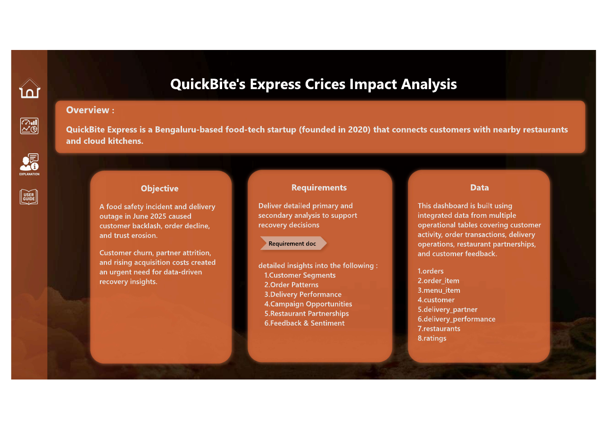
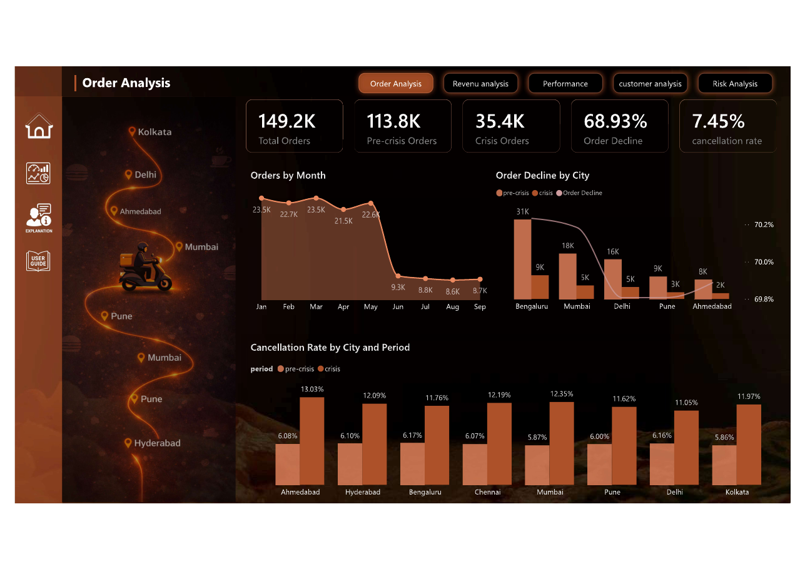
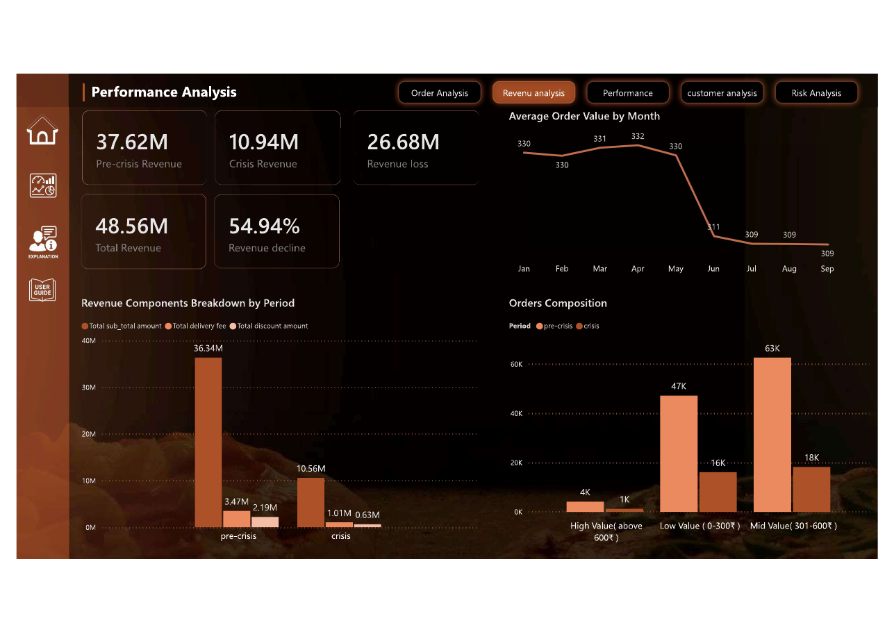
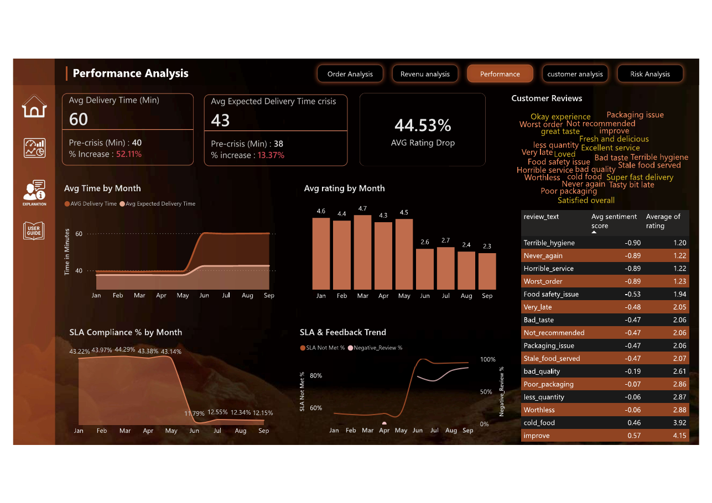
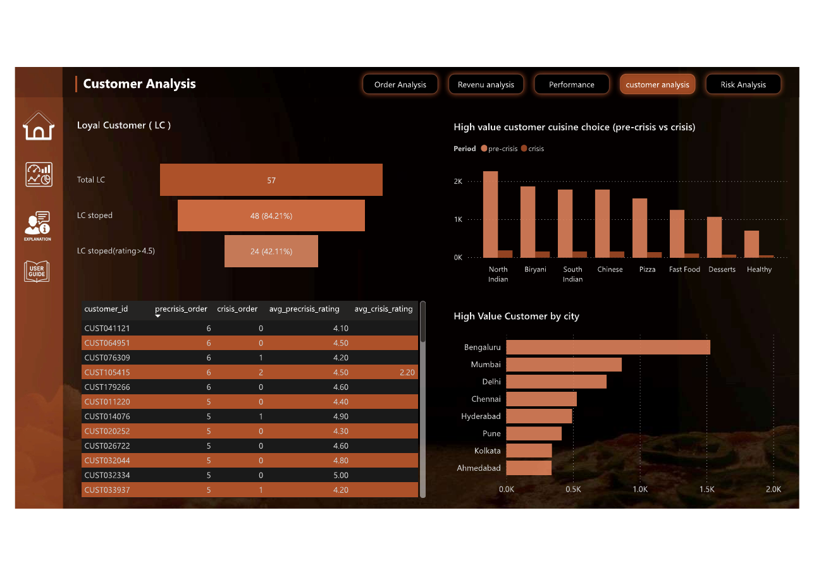
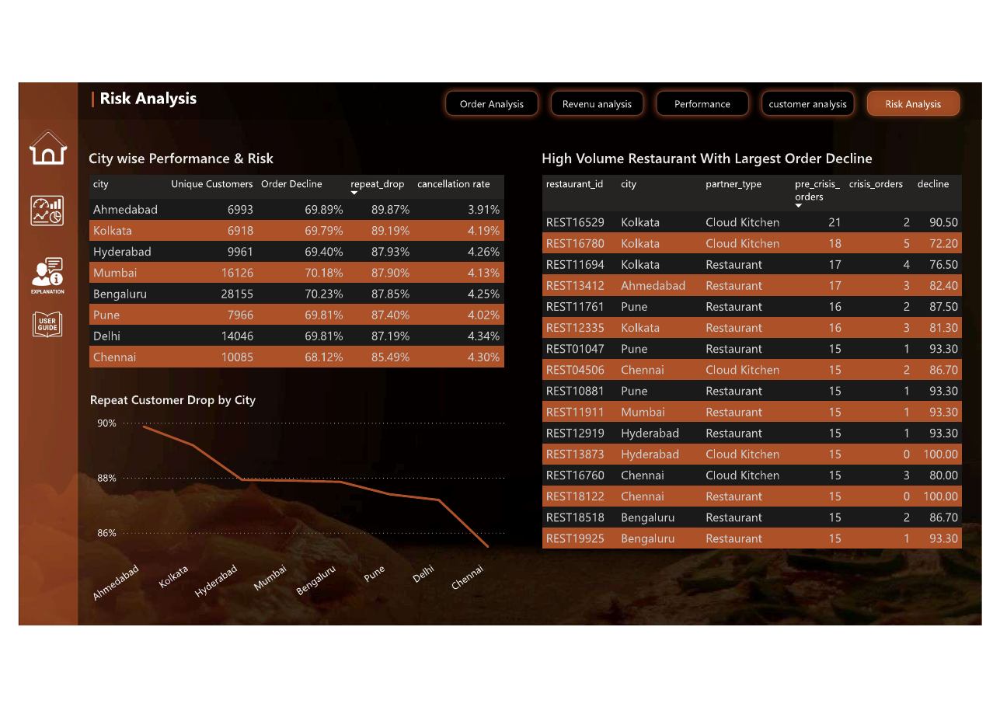

# QuickBite Express Crisis Impact Analysis

> **End-to-end business impact analysis of a food-safety incident and delivery outage using SQL, Python, machine learning, and Power BI to identify revenue loss, customer churn, operational breakdowns, and recovery priorities.**

## Table of Contents

- [Business Problem](#business-problem)
- [Data Description](#data-description)
- [Tools and Technologies](#tools-and-technologies)
- [Project Workflow](#project-workflow)
- [Project Structure](#project-structure)
- [Key Findings and Business Impact](#key-findings-and-business-impact)
- [Machine Learning](#machine-learning)
- [Recovery Recommendations](#recovery-recommendations)
- [Dashboard](#dashboard)
- [How to Run](#how-to-run)
- [Author and Contact](#author-and-contact)

## Business Problem

QuickBite Express, a Bengaluru-based food-tech startup, faced a major business crisis in June 2025 after a food-safety incident and a week-long delivery outage triggered customer backlash, operational disruption, and partner attrition.

The objective was to determine:

- How severely demand and revenue were affected.
- Whether the disruption was operational, customer-driven, or city-specific.
- How delivery performance and customer sentiment changed.
- Which loyal and high-value customers were lost.
- Which cities, restaurants, and customer segments required recovery priority.
- What actions could rebuild trust and protect future revenue.

**Analysis period:** January–September 2025  
**Comparison:** Pre-crisis (Jan–May) vs Crisis (Jun–Sep)

## Data Description

The analysis integrates transactional, operational, customer, restaurant, delivery, and feedback data provided for the project.

### Core tables

- `orders`
- `order_items`
- `menu_item`
- `customer`
- `delivery_partner`
- `delivery_performance`
- `restaurants`
- `ratings`
- `calculated_customer`
- `calculated_restaurant`
- `high_value_customer`

The dataset contains approximately **149.2K orders** across the analysis period.

Raw datasets are intentionally excluded from the repository to avoid committing large source files.

## Tools and Technologies

| Area | Tools |
|---|---|
| Data analysis | Python, pandas, NumPy |
| Machine learning | scikit-learn, K-Means, PCA |
| Data preparation | SQL Server, SQL |
| Visualization | Power BI |
| Notebook | VsCode Jupyter Notebook |
| Analysis | Customer segmentation, cohort comparison, KPI analysis, recovery scoring |

## Project Workflow

```text
Source Data
    ↓
SQL Server
    ↓
Data Cleaning & Validation
    ↓
Python Feature Engineering
    ↓
Customer Segmentation
    ↓
Recovery Priority Engine
    ↓
Power BI Dashboard
    ↓
Business Impact & Recovery Recommendations
```

## Project Structure

```text
crisis-impact-analysis-quickbite-express-python-sql-server-power-bi/
│
├── README.md
├── .gitignore
├── requirements.txt
│
├── data/
│   └── data_dictionary.md
│
├── notebooks/
│   └── quickbite_customer_segmentation_and_recovery_engine.ipynb
│
├── sql/
│   └── README.md
│
├── scripts/
│   └── README.md
│
├── dashboard/
│   ├── quickbite_crisis_impact_dashboard.pdf
│   └── README.md
│
└── images/
    ├── overview.png
    ├── order_analysis.png
    ├── revenue_analysis.png
    ├── performance_analysis.png
    ├── customer_analysis.png
    ├── risk_analysis.png
    └── user_guide.png
```

## Key Findings and Business Impact

### 1. Demand collapsed

- **149.2K** total orders analyzed.
- **113.8K** orders before the crisis.
- **35.4K** orders during the crisis.
- **68.93%** overall order decline.
- June orders fell from **22.6K to 9.3K**, approximately a **59% month-over-month decline**.
- Orders then remained around **9K per month**, showing no meaningful recovery.

**Business impact:** The sustained decline indicates a severe trust and reliability problem rather than a temporary demand fluctuation.

### 2. Revenue fell by more than half

- Pre-crisis revenue: **₹37.62M**
- Crisis revenue: **₹10.94M**
- Revenue loss: **₹26.68M**
- Revenue decline: **54.94%**

The largest reduction came from order subtotal revenue, which fell from **₹36.34M to ₹10.56M**.

### 3. Operations deteriorated

- Average delivery time increased from **40 to 60 minutes**.
- Delivery time increased by **52.11%**.
- Expected delivery time increased from approximately **38 to 43 minutes**.
- SLA compliance collapsed from approximately **43% to 12%**.
- Cancellation rates increased from approximately **6% to 11–13%** across cities.

**Business impact:** Delivery reliability became a direct driver of customer dissatisfaction, cancellations, and lost repeat demand.

### 4. Customer trust broke down

- Average ratings were approximately **4.3–4.7** before the crisis.
- Ratings dropped sharply from approximately **4.5 to 2.6** after the crisis.
- Negative feedback centered on hygiene, service quality, delivery delays, packaging, and food quality.
- Terms such as `never again` and `not recommended` indicated broader trust erosion.

### 5. Loyal customers were heavily affected

Among customers with at least five pre-crisis orders:

- **57** loyal customers identified.
- **48 (84.21%)** stopped ordering during the crisis.
- **24 (42.11%)** of the churned loyal customers had a pre-crisis average rating above **4.5**.

**Business impact:** QuickBite lost customers who had already demonstrated both loyalty and satisfaction, making targeted re-engagement more valuable than broad acquisition campaigns.

### 6. The crisis affected the entire platform

Major cities experienced similar order declines of roughly **67–71%**, including Bengaluru, Mumbai, Delhi, Pune, and Ahmedabad.

This consistency indicates a **platform-wide trust and reliability issue**, rather than an isolated city-level problem.

## Machine Learning

The customer recovery analysis used an unsupervised segmentation and scoring pipeline.

### Customer segmentation

Customer-level features were engineered from historical behavior, including:

- Order frequency
- Spending behavior
- Average ratings
- Pre-crisis activity
- Crisis activity
- Customer engagement indicators

Missing ratings were handled using **KNN imputation**.

K-Means cluster evaluation produced:

| K | Silhouette Score |
|---:|---:|
| 2 | 0.4188 |
| 3 | 0.5020 |
| 4 | 0.4861 |

`K=3` produced the highest silhouette score, while `K=4` was selected for stronger business interpretability.

### Recovery priority engine

The final segmentation identified:

- High-Value Active Customers
- Dormant Satisfied Customers
- Dissatisfied Active Customers
- VIP Loyal Customers

The notebook then combined customer value, satisfaction, activity, and churn signals into recovery-priority scores and generated **94K+ customer-intelligence records** for targeted recovery analysis.

## Recovery Recommendations

1. **Fix service reliability before increasing discounts**
   - Reduce delivery delays and SLA breaches.
   - Strengthen delivery capacity and monsoon contingency planning.

2. **Rebuild trust transparently**
   - Communicate the food-safety failures and corrective actions.
   - Introduce visible safety verification and reliability commitments.

3. **Target loyal and high-value churned customers**
   - Prioritize customers with strong pre-crisis order history and satisfaction.
   - Use personalized cashback, free delivery, or loyalty credits instead of mass discounts.

4. **Prioritize cities by business risk**
   - Protect high-value customer bases in major metros.
   - Focus trust and reliability improvements where repeat-customer decline is highest.

5. **Monitor recovery continuously**
   - Track delivery time, SLA compliance, cancellations, ratings, repeat orders, and customer reactivation.

## Dashboard

The Power BI dashboard converts the analysis into five decision areas:

- Order Analysis
- Revenue Analysis
- Performance Analysis
- Customer Analysis
- Risk Analysis

### Dashboard Overview



### Order Analysis



### Revenue Analysis



### Performance Analysis



### Customer Analysis



### Risk Analysis



> The repository contains the exported dashboard views and PDF. The original Power BI `.pbix` source file is not available.

## How to Run

### 1. Clone the repository

```bash
git clone <repository-url>
cd crisis-impact-analysis-quickbite-express-python-sql-server-power-bi
```

### 2. Create a virtual environment

```bash
python -m venv venv
```

### 3. Activate the environment

**Windows**

```bash
venv\Scripts\activate
```

**macOS/Linux**

```bash
source venv/bin/activate
```

### 4. Install dependencies

```bash
pip install -r requirements.txt
```

### 5. Run the notebook

Open:

```text
notebooks/quickbite_customer_segmentation_and_recovery_engine.ipynb
```

The notebook requires access to the project database/data source referenced by the notebook. Raw source data is not included in this repository.

## Author and Contact

**Tapasya Mendole**

- [LinkedIn](<linkedin-profile-url>)
- [GitHub](<github-profile-url>)
- [Portfolio](<portfolio-url>)
- Email: `<email-address>`
